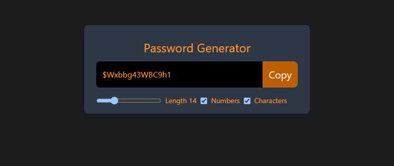

# Password Generator in React

A modern React application that generates secure passwords based on user preferences. Built with React + Vite and styled with Tailwind CSS.



## Features

- Generate random passwords with customizable length (8-32 characters)
- Include/exclude numbers in password generation
- Include/exclude special characters in password generation
- Copy password to clipboard with a single click
- Real-time password generation on preference changes

## Tech Stack

- React 18
- Vite
- Tailwind CSS
- React Hooks (useState, useCallback, useEffect, useRef)

## Getting Started

### Prerequisites

- Node.js (v14 or higher)
- npm or yarn

### Installation

1. Clone the repository
```bash
git clone https://github.com/abdulrehmana28/react_passwordgenerator.git
```

2. Navigate to project directory
```bash
cd password-generator
```

3. Install dependencies
```bash
npm install
# or
yarn install
```

4. Start the development server
```bash
npm run dev
# or
yarn dev
```

5. Open your browser and visit `http://localhost:5173`

## Usage

1. Adjust the password length using the slider (8-32 characters)
2. Toggle numbers inclusion using the "Numbers" checkbox
3. Toggle special characters inclusion using the "Characters" checkbox
4. Click the "Copy" button to copy the generated password to clipboard

## Development

### Available Scripts

- `npm run dev` - Start development server
- `npm run build` - Build for production
- `npm run preview` - Preview production build
- `npm run lint` - Run ESLint

### Project Structure

```
password-generator/
├── src/
│   ├── App.jsx        # Main application component
│   ├── App.css        # Component styles
│   └── main.jsx       # Application entry point
└── index.html         # HTML template
```

## Contributing

1. Fork the repository
2. Create your feature branch (`git checkout -b feature/AmazingFeature`)
3. Commit your changes (`git commit -m 'Add some AmazingFeature'`)
4. Push to the branch (`git push origin feature/AmazingFeature`)
5. Open a Pull Request

## License

This project is licensed under the MIT License - see the [LICENSE](LICENSE) file for details.

## Acknowledgments

- Built with [React](https://reactjs.org/)
- Styled using [Tailwind CSS](https://tailwindcss.com/)
- Developed with [Vite](https://vitejs.dev/)
